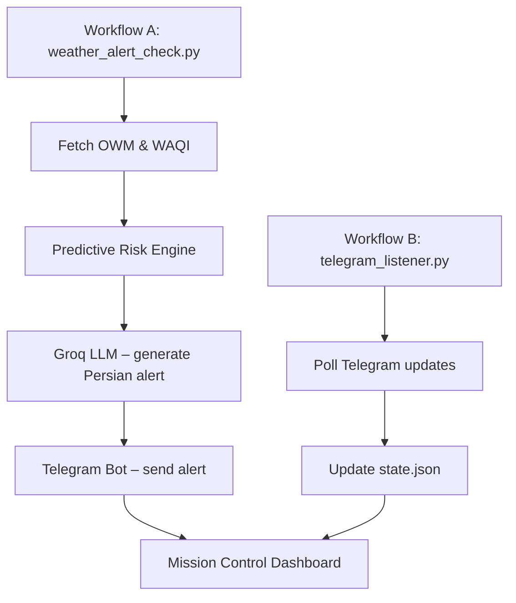

# Urban Weather Intelligence & Early Warning System

## Project Overview
This repository implements a **server‑less, automated weather monitoring and alerting system** for the city of Mashhad, Iran. It continuously fetches real‑time meteorological data from **OpenWeatherMap (OWM)** and air‑quality indices from **World Air Quality Index (WAQI)**, evaluates risk through a **Predictive Risk Engine**, and delivers human‑friendly Persian alerts via a **Telegram bot**.

## Why Server‑less?
GitHub Actions provides a stateless execution environment, but our use‑case demands:
1. **Persistent state** – stored in `state.json` and committed back to the repository after each run.
2. **Bidirectional communication** – a second workflow (`telegram_listener.py`) polls Telegram updates (acknowledgments, commands) and updates the shared state.

## Architecture

- **Workflow A** runs every 20 min, fetches data for the 10 configured zones, decides whether to emit an *Alert* or a *Clear‑Skies* brief, stores the outcome in `state.json`, and updates the HTML dashboard.
- **Workflow B** runs every 30 min, processes user acknowledgments or admin commands, and mutates `state.json` to guarantee idempotent messaging.

## Core Features
- **Automated Risk Assessment** – thresholds: wind > 15 m/s, precipitation probability > 70 %, AQI > 150.
- **Predictive Warning** – synthesized when any threshold is breached, even without an official OWM alert.
- **Unique Alert Hash** – `alert_id_for` hashes only `event` + `start` to prevent duplicate spam.
- **Graceful Degradation** – fallback payload (20 °C, 30 % humidity, 5 m/s wind) is used when OWM is unreachable.
- **Rich Persian Messaging** – Groq LLM adds emojis, formatting, and context‑aware explanations.
- **Mission Control Dashboard** – dark‑mode HTML page with GSAP animations, Leaflet map, and per‑zone status markers.

## Getting Started
```bash
# Clone the repository
git clone https://github.com/yourorg/weather-alarm.git
cd weather-alarm

# Install dependencies (standard library only for core, optional for tests)
pip install -r requirements.txt

# Export required secrets (GitHub Actions uses repository secrets)
export OWM_API_KEY=your_owm_key
export GROQ_API_KEY=your_groq_key
export TELEGRAM_BOT_TOKEN=your_bot_token
export AUTHORIZED_USER_ID=your_telegram_user_id
```
Run locally in test mode:
```bash
TEST_MODE=true AUTHORIZED_USER_ID=999 TELEGRAM_BOT_TOKEN=xxx GROQ_API_KEY=yyy \
  python3 tests/test_pipeline.py
```

## Testing
- `TEST_MODE=true` loads `tests/fixtures/sample_alert.json` instead of live OWM data.
- `MOCK_ALERT=true` forces a severe synthetic alert for UI verification.

## Future Enhancements
- **SMS fallback** via Kavenegar for users without Telegram.
- **Extended coverage** – add rural zones and additional meteorological stations.
- **Real‑time dashboard** – WebSocket‑driven updates or a lightweight serverless function.
- **On‑device LLM** – replace Groq with an open‑source model to eliminate external dependencies.

## License
MIT © 2024‑2026


## Project Goal
To provide an automated weather surveillance system for Mashhad, Iran. The system fetches live meteorological data from OpenWeatherMap One Call API v3, applies a Predictive Risk Engine, dispatches AI-generated Persian alerts via a Telegram bot, and maintains a self-updating "Mission Control" HTML dashboard committed back to the repository on every run.

## Why the Initial Architecture (Cron on GitHub Actions) Was Not Enough
Every execution of GitHub Actions runs on a fresh, stateless virtual machine that is destroyed at the end of the run. For a "resend until user ack" feature, two things missing in a purely stateless architecture are required:

1. Persistent memory that survives across different runs (the state of each alert, for each user).
2. A way to receive incoming messages/callbacks from the user (not just sending outputs).

**Solution:** A `state.json` file in the repository that each run reads and commits, plus a second workflow that independently polls Telegram's incoming updates.

## Architecture Components

| Component | Responsibility | Trigger |
|---|---|---|
| `weather_alert_check.py` (Workflow A) | Fetch real data for 10 Mashhad zones, run Predictive Risk Engine, dispatch alerts | Cron every 20 min |
| `telegram_listener.py` (Workflow B) | Receive Telegram updates, record acks, enforce auth | Cron every 30 min |
| `visualize_alert.py` | Dynamically overwrites `alert_report.html` with live metrics | Called by Workflow A |
| `weather_client.py` | OpenWeatherMap One Call API v3 client; serves fixture in TEST_MODE | — |
| `groq_client.py` | Deterministic Persian alert text generation via Groq LLM | — |
| `telegram_client.py` | Sends messages, locations, and polls incoming updates | — |
| `state.json` | Sole shared persistent state between both workflows | Versioned file in repo |
| `severity.py` | Alert severity classification and safety-tip lookup | — |

## Geographical Coverage (Multi-Zone)
`config/zones.json` includes 10 strategic monitoring zones spread across Mashhad. Each Workflow A execution loops over all points, fetches the full OWM payload, and merges identical alerts via MD5 hash of `event + start` to prevent subscriber spam from multi-zone storms.

## Predictive Risk Engine
When the OpenWeatherMap `alerts` array is **empty**, the engine evaluates raw meteorological parameters across all zones:

| Parameter | Source | Threshold |
|---|---|---|
| `pop` | `hourly[0:24]` max | > 70% |
| `wind_speed` | `current.wind_speed` max | > 15 m/s |
| `uvi` | `current.uvi` max | tracked only |
| `temp` | `current.temp` avg | tracked only |

If any threshold is breached, a **Predictive Warning** alert is synthesized locally and dispatched via Groq LLM with the exact risk values included in the message.

## Strict Telegram Authorization
Both workflows enforce the `AUTHORIZED_USER_ID` GitHub Secret:
- `telegram_listener.py`: Silently drops any message or callback from a chat ID that does not match.
- `weather_alert_check.py`: Skips any subscriber record whose chat ID does not match.

This prevents unauthorized users from receiving sensitive meteorological data or registering themselves as subscribers.

## Clear Skies Daily Brief
If conditions are calm (no alerts, wind ≤ 15 m/s, pop ≤ 70%) and at least **24 hours** have elapsed since the last brief, the system dispatches a "System Operational — Clear Skies" message to the authorized user. This ensures the pipeline is never silently failing without notification. The timestamp is persisted in `state.json` under `last_daily_brief`.

## Alert State Machine (Per User)

```
NO_ALERT ──(new alert)──► PENDING_ACK
PENDING_ACK ──(resend interval passed & not acked)──► PENDING_ACK (resend_count++)
PENDING_ACK ──(user clicks Acknowledge inline button)──► ACKED
PENDING_ACK ──(alert no longer in API)──► EXPIRED
ACKED / EXPIRED ──(new alert appears)──► PENDING_ACK
```

## API Inputs/Outputs

### 1. OpenWeatherMap One Call v3 — `weather_client.fetch_weather_data_for_zone`
Request params: `lat`, `lon`, `appid`, `exclude=minutely`, `units=metric`, `lang=fa`

> **Important:** `units=metric` is mandatory. Without it, temperatures are returned in Kelvin and all parsed metrics will be incorrect.

Output structure (relevant sections):
```json
{
  "current": {
    "temp": 34.7,
    "humidity": 28,
    "wind_speed": 17.2,
    "uvi": 9.5
  },
  "hourly": [{ "pop": 0.85 }],
  "alerts": [{
    "event": "Flash Flood Warning",
    "start": 1755248400,
    "end": 1755262800,
    "description": "string",
    "tags": ["Flood"]
  }]
}
```

### 2. Groq — `groq_client.summarize_description`
Input: `event`, `description`, `probability` (integer percentage)
Output: A deterministic Persian string with HTML formatting, explicitly including the statistical probability of the weather event.

### 3. Telegram — `telegram_client`
- `send_message(token, chat_id, text, reply_markup)` — Sends alert with Inline Keyboard for acknowledgment.
- `send_location(token, chat_id, lat, lon)` — Sends the zone epicenter map pin before the alert.
- `get_updates(token, offset)` — Polls updates including `callback_query` and `message` payloads.

## Mission Control HTML Dashboard
`alert_report.html` is a self-contained dark-mode dashboard updated on every Workflow A run:
- **GSAP animations** for all metric values.
- **Leaflet interactive map** with per-zone color-coded status markers.
- **Dynamic Risk Score**, AI Briefing, and Active Alerts center.
- Updated via Python `re` (regex) string replacement — no third-party HTML parser required.

## Testing Without Real Alerts (TEST_MODE)
Set `TEST_MODE=true` to load `tests/fixtures/sample_alert.json` instead of calling the live OWM API. This also relaxes the `OWM_API_KEY` validation guard and force-registers `AUTHORIZED_USER_ID` as a subscriber, exercising the full pipeline (Risk Engine → Groq → Telegram → HTML) in CI without real credentials.

Run the end-to-end pipeline test locally:
```bash
TEST_MODE=true AUTHORIZED_USER_ID=999 TELEGRAM_BOT_TOKEN=x GROQ_API_KEY=x \
  python3 tests/test_pipeline.py
```

The fixture `tests/fixtures/sample_alert.json` contains a full OWM-shaped mock payload with `current`, `hourly`, `daily`, and `alerts` blocks (wind=17.2 m/s, pop=0.90) that trigger the predictive engine thresholds.

## Future Feature — SMS Dispatch
A user's `phone_number` can be saved in `state.json` using the `/setphone 09xxxxxxxxx` command. A placeholder `dispatch_sms` function exists in `weather_alert_check.py`. The proposed escalation layer: if `resend_count` passes a threshold and the user hasn't acknowledged, the message is also sent via an SMS gateway (e.g., Kavenegar for Iranian numbers).

## Required GitHub Secrets

| Secret | Purpose |
|---|---|
| `TELEGRAM_BOT_TOKEN` | Telegram Bot API token |
| `OWM_API_KEY` | OpenWeatherMap One Call API v3 key (requires billing setup) |
| `GROQ_API_KEY` | Groq LLM API key |
| `AUTHORIZED_USER_ID` | Telegram user ID of the sole authorized subscriber |
