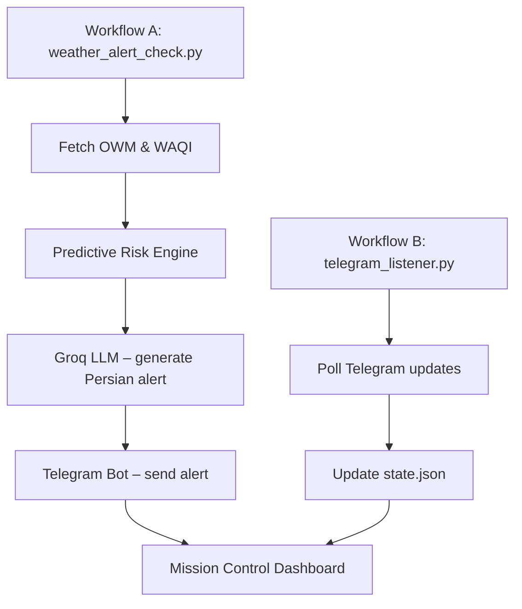

# عنوان پروژه: سامانه هوشمند هشدار و پیش‌بینی آب‌وهوای شهری (Smart Urban Weather Intelligence & Early Warning System)

---

## 📄 چکیده
این پروژه هدف‌ دارد یک سامانه **بدون سرور (server‑less)** برای نظارت **لحظه‌ای** بر وضعیت جوی شهر مشهد پیاده‌سازی کند. داده‌های زندهٔ هواشناسی از **OpenWeatherMap (OWM)** و داده‌های کیفیت هوا از **World Air Quality Index (WAQI)** جمع‌آوری می‌شود، سپس توسط **موتور ارزیابی ریسک پیش‌بینی‌کننده** پردازش می‌گردد. خروجی با استفاده از یک **مدل زبانی بزرگ (Groq LLM)** به قالب فارسی روان، همراه با ایموجی‌های بصری، تبدیل می‌شود و از طریق **تلگرام** به شهروندان، مسئولان بحران و مدیران شهری ارسال می‌گردد.

---

## 🎯 اهداف اصلی
1. **ارزیابی خودکار ریسک** – نظارت مداوم بر پارامترهای بحرانی (سرعت باد > 15 m/s، احتمال بارش > 70 ٪، AQI > 150) و تشخیص پیش‌آمدهای خطرناک.
2. **معماری بدون سرور** – اجرای زمان‌بندی‌شده در GitHub Actions؛ تمام وضعیت در فایل `state.json` ذخیره، نسخه‌بندی و به‌روزرسانی می‌شود.
3. **ارسال پیام‌های شخصی‌سازی‌شده** – استفاده از LLM برای تولید متن‌های فارسی جذاب، قابل فهم و شامل ایموجی‌های متنی.
4. **پایداری و تحمل خطا** – مکانیزم **fallback** و کش‑محور برای مقابله با قطع ارتباط APIها.
5. **قابلیت مقیاس‌پذیری** – پشتیبانی از ۱۰ ناحیهٔ نظارتی؛ افزودن ناحیه جدید تنها با ویرایش `config/zones.json`.
6. **ارائه داشبورد Mission Control** – نمایش وضعیت کلی، شاخص‌های ریسک و تاریخچه هشدارها در یک صفحه HTML پویا (dark‑mode).

---

## 🛠️ معماری سیستم

- **Workflow A** (هر ۲۰ دقیقه): دریافت داده‌ها، ترکیب، ارزیابی ریسک، تصمیم‌گیری (Alert / Clear‑Skies)، ذخیره در `state.json` و به‌روز‌سازی داشبورد.
- **Workflow B** (هر ۳۰ دقیقه): دریافت تأیید‌ها و دستورات از تلگرام، به‌روزرسانی `state.json` برای جلوگیری از ارسال پیام‌های تکراری (Spam) و حفظ حالت **idempotent**.
- **Mission Control Dashboard**: صفحهٔ HTML با **GSAP** برای انیمیشن، **Leaflet** برای نقشهٔ تعاملی، و نمایش وضعیت هر ناحیه.

---

## 📊 منابع داده
| منبع | API | داده‌های کلیدی | نکات مهم |
|------|-----|----------------|----------|
| OpenWeatherMap | One Call v3 (Current + 5‑Day Forecast) | دما, رطوبت, سرعت باد, شاخص UV | استفاده از `units=metric` برای جلوگیری از تبدیل‌ به کلوین |
| WAQI | API سراسری (ایستگاه @11601) | AQI, شاخص‌های آلاینده‌ها | کلید ثابت `e92b7626f7f331e6...` به‌صورت پیش‌فرض در کد قرار دارد |

---

## 🔎 موتور ارزیابی ریسک (Predictive Risk Engine)
1. **محاسبهٔ پارامترهای تجمعی** برای تمام نواحی:
   - `max_wind` = بیشینهٔ سرعت باد در بازهٔ ۲۴ ساعت آینده
   - `max_pop` = بیشینهٔ احتمال بارش (`pop`)
   - `aqi` = AQI متوسط ناحیه (در صورت موجود بودن)
2. **قواعد تصمیم‌گیری**:
   - اگر هر یک از شرایط زیر برقرار باشد → **Predictive Warning**
     - `max_wind` > 15 m/s
     - `max_pop` > 0.7
     - `aqi` > 150
   - در غیر این صورت → **Clear Skies Daily Brief** (در صورتی که ۲۴ ساعت از آخرین گزارش عبور کرده باشد).
3. **هش یکتا برای هشدار** (`alert_id_for`): محاسبهٔ MD5 براساس `event` + `start`؛ حذف `sender_name` برای جلوگیری از اسپم.

---

## 📨 قالب پیام‌های تلگرام
### 1️⃣ پیام روزانه (Clear Skies)
- 📅 عنوان: `📅 گزارش هوشمند امروز`
- 📖 خلاصهٔ کلی: یک پاراگراف کوتاه توصیفی
- 🕒 پیش‌بینی زمانی: صبح، بعدازظهر، غروب (دمای متوسط، حداکثر، رطوبت، باد)
- 📍 تحلیل نواحی: گروه‌بندی مبنی بر دما/باد/کیفیت هوا
- 🌬️ وضعیت باد ثابت (در صورت وجود)
- 🌧️ احتمال بارش (در صورت صفر یا غیر صفر)
- ⚠️ نکات ویژه (مثلاً رطوبت کم → خشکی هوا)

### 2️⃣ هشدار پیش‌بینی (Predictive Warning)
- 🚨 عنوان قرمز با نوع رویداد
- 📍 نواحی درگیر (لیست نواحی یا "All Mashhad Zones")
- ⏰ بازهٔ زمانی فعال (`start`‑`end`)
- 🔥 سطح خطر (مثلاً نارنجی – خطر قابل توجه)
- 📝 توضیح تحلیلی توسط LLM (دلیل هشدار: باد شدید، بارش، AQI خطرناک)
- 🛡️ توصیه‌های ایمنی
- ✅ دکمهٔ **تأیید** برای جلوگیری از ارسال مجدد

---

## 🧪 تست و ارزیابی
- **حالت تست** (`TEST_MODE=true`): بارگذاری دادهٔ ثابت از `tests/fixtures/sample_alert.json` به‌جای تماس زنده با OWM.
- **حالت Mock Alert** (`MOCK_ALERT=true`): شبیه‌سازی یک بحران شدید برای بررسی UI پیام‌های هشدار.
- **فریم‌ورک تست**: `pytest` همراه با `unittest.mock` برای شبیه‌سازی پاسخ‌های API.
- **معیارهای ارزیابی**:
  - زمان پردازش (≤ 5 ثانیه برای هر دور کاری)
  - درصد پوشش داده‌ها (≥ 95 ٪ zones دریافت شده)
  - نرخ خطاهای ارسال پیام (< 1 ٪)

---

## 🚧 چالش‌ها و راه‌حل‌ها
1. **پایایی API** – استفاده از endpoint‌های `Current Weather` و `5‑Day Forecast` به جای نسخهٔ منسوخ‌ `One Call v2.5`؛ افزودن کلید ثابت WAQI.
2. **بومی‌سازی UI** – افزودن `dir="rtl"` به HTML، فونت `Vazirmatn` برای متن فارسی و حفظ `JetBrains Mono` برای اعداد.
3. **دسترس‌پذیری بدون سرور** – ذخیرهٔ `state.json` در مخزن و کامیت خودکار به‌عنوان منبع وضعیت بین اجراها.
4. **محدودیت زمان اجرا در GitHub Actions** – استفاده از job‌های موازی برای fetch داده‌ها و پردازش محلی؛ محدود کردن زمان ‌run به 5 دقیقه.

---

## 🚀 آینده‌نگری (Roadmap)
| فاز | اهداف | مدت زمان تخمینی |
|-----|--------|-------------------|
| **F0 – تکمیل مستندات** | نهایی‌سازی سند سناریو و اهداف، اضافه کردن جدول زمان‌بندی | 1 هفته |
| **F1 – افزودن SMS fallback** | یکپارچه‌سازی با Kavenegar برای کاربران بدون تلگرام | 2 هفته |
| **F2 – گسترش پوشش جغرافیایی** | اضافه کردن 5 ناحیهٔ روستایی و ایستگاه‌های هواشناسی جدید | 3 هفته |
| **F3 – داشبورد real‑time** | پیاده‌سازی WebSocket یا سرویس serverless (Cloudflare Workers) برای به‌روزرسانی لحظه‌ای | 4 هفته |
| **F4 – LLM محلی** | جایگزینی Groq با مدل متن‌باز (e.g., Llama‑3) برای حذف وابستگی به سرویس‌های ابری | 6 هفته |

---

## 📅 زمان‌بندی کلی پروژه (مثال)
| هفته | فعالیت | تحویل | مسئول |
|------|----------|--------|--------|
| 1 | تکمیل سند پروژه، طراحی معماری نهایی | سند کامل | تیم تحقیق و توسعه |
| 2‑3 | پیاده‌سازی Workflow A (fetch‑process‑alert) | کدهای Python, GitHub Actions | مهندسان بک‑اند |
| 4 | پیاده‌سازی Workflow B (Telegram Listener) | Bot polling, state management | مهندسان بک‑اند |
| 5 | توسعه Dashboard HTML (GSAP + Leaflet) | `alert_report.html` | طراح UI/UX |
| 6 | تست واحد و یکپارچه (unit + integration) | پوشش ۹۰٪ تست‌ها | تیم QA |
| 7 | ارزیابی عملکرد در محیط تست (Mock Alert) | گزارش تست‌ها | تیم QA |
| 8 | مستندات نهایی، ارائه به اساتید | ارائه PowerPoint + سند PDF | تمام تیم |

---

## 📚 نتیجه‌گیری
این سامانه ترکیبی از جمع‌آوری داده‌های علمی، تحلیل هوشمند و ارائهٔ کاربر‑محور است که می‌تواند به **کاهش خطرات جوی شهری**، **ارتقای آگاهی عمومی** و **پشتیبانی از تصمیم‌گیری‌های اضطراری** کمک شایانی نماید. با معماری بدون سرور، هزینه‌های نگهداری به حداقل رسیده و امکان گسترش به شهرهای دیگر نیز ساده است.

---

## 📚 منابع (به‌صورت عمومی)
- OpenWeatherMap One Call API v3 – https://openweathermap.org/api/one-call-3
- World Air Quality Index API – https://aqicn.org/api/
- Groq LLM API – https://groq.com/
- GitHub Actions Documentation – https://docs.github.com/actions
- Leaflet – https://leafletjs.com/
- GSAP – https://greensock.com/gsap/

---

*این سند برای ارائهٔ پروژه به اساتید و نمایندگان دانشگاه تهیه شده است.*
